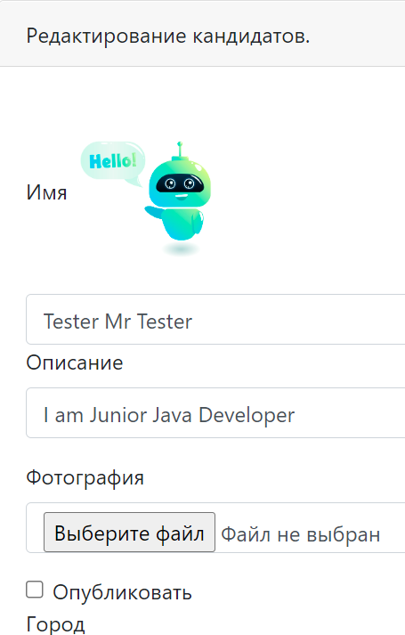

<h1>job4j_dreamjob</h1>
Проект «Dream Job» — это учебный проект, который представляет собой сервис по поиску вакансий и кандидатов. Проект создан с использованием технологии Spring Boot.
По запросу любой страницы происходит фильтр текущей сессии через java.servlet.Filter и переадресация пользователя на страницу авторизации. Только авторизованный пользователь может создавать/ редактировать вакансии и кандидатов. Все записи сохраняются в базу данных.  

Используемые технологии в проекте:
- Spring boot 2.5.2
- Thymeleaf,
- Bootstrap,
- PostgreSQL 42.2.9
- Junit 4.13.2
- AssertJ 3.23.1
- log4j 1.2.17
- JCIP Annotations 1.0
- DBCP 2 2.7.0
- h2database 1.4.200
- Mockito 3.5.13
- checkstyle-plugin 3.1.2
- puppycrawl 9.0
- Liquibase 3.6.2

Необходимое окружение:
- Java 15+
- Maven 3.8
- PostgreSQL 14

Для запуска приложения необходимо:

1. Создать базу данных с именем dreamjob
```sql
    create database cinema;
```

2. Собрать проект и запустить приложение Spring Boot
```
    mvn clean install
    mvn spring-boot:run
```

### Страницы с авторизацией и аутентификацией пользователя:


### Основная страница со списком вакансий и кандидатами:


### Страницы добавления и редактирования:





По всем вопросам по данному проекту вы можете написать мне на email kuptsovns@gmail.com


<h1>job4j_dreamjob</h1>
Dream Job is a educational project, representing a job and candidate search service. The project was developed using the Spring Boot technology.
Upon request for any page, the current session is filtered through java.servlet.Filter and the user is redirected to the authorization page. Only the authorized user can create/edit jobs and candidates. All entries are saved in the database.  

Technologies used in the project: 
- Spring boot 2.5.2
- Thymeleaf, 
- Bootstrap, 
- PostgreSQL 42.2.9
- Junit 4.13.2
- AssertJ 3.23.1
- log4j 1.2.17
- JCIP Annotations 1.0
- DBCP 2 2.7.0
- h2database 1.4.200
- Mockito 3.5.13
- checkstyle-plugin 3.1.2
- puppycrawl 9.0
- Liquibase 3.6.2

Required environment:
- Java 15+
- Maven 3.8
- PostgreSQL 14

To run the application you need:

1. Create a database named dreamjob
```ql
    create database dreamjob;
```

2. Build the project and run the Spring Boot application
```
    mvn clean install
    mvn spring-boot:run
```

### Pages with user authorization and authentication:


#### Main page with job listings and candidates:


#### Add and edit pages:


If you have any questions about this project you can email me at kuptsovns@gmail.com

